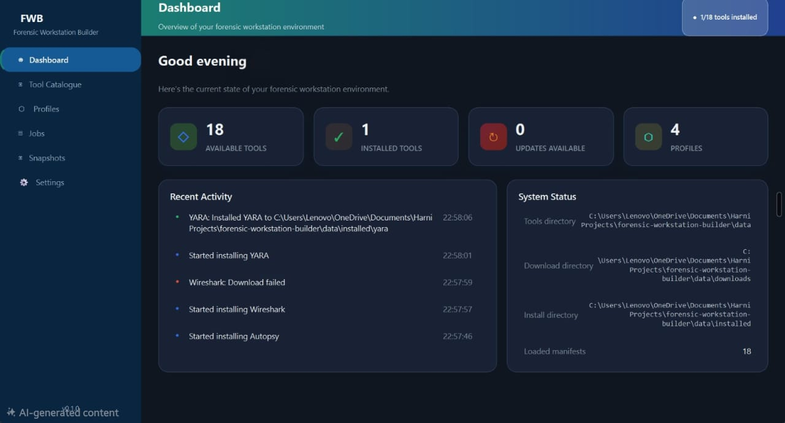
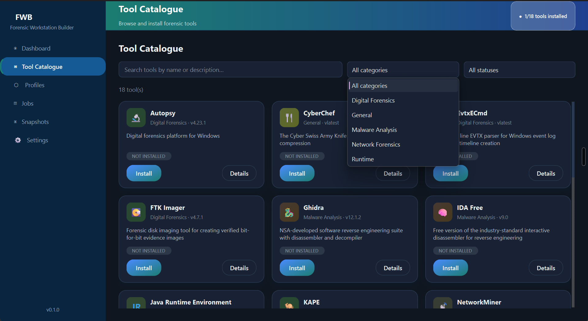
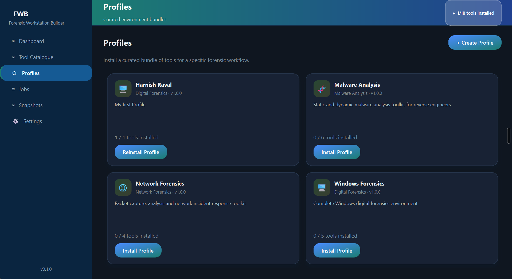
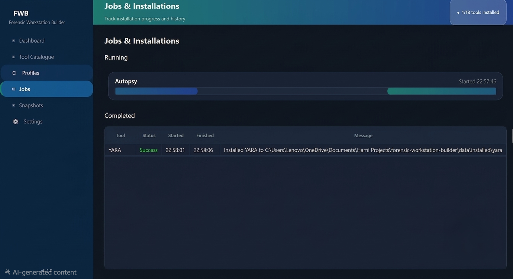
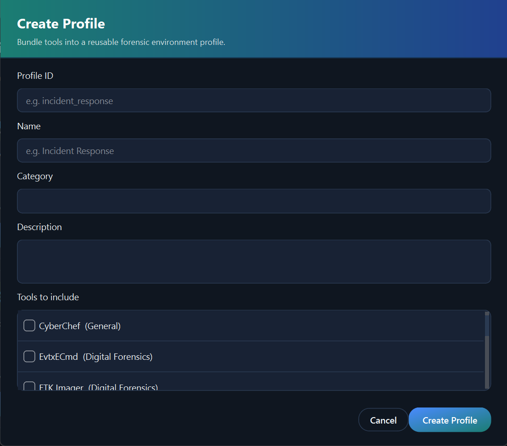
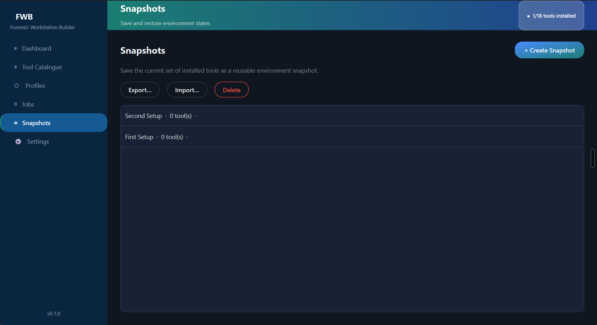
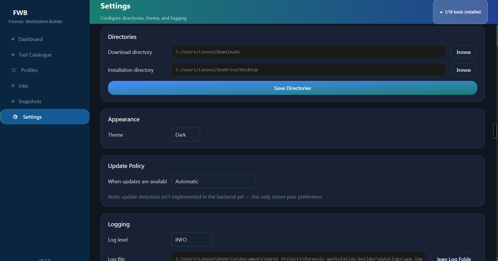

# 🔬 Forensic Workstation Builder

> A secure platform for discovering, installing, and reproducing digital forensics and cybersecurity tool environments — with one click.

---

## 🎯 What It Does

Digital forensics investigators need 10+ specialized tools to analyze systems. Installing them manually takes hours and is error-prone.

**Forensic Workstation Builder** solves this by providing a beautiful GUI and CLI to:

- **Browse** 18 forensic tools
- **Install** tools with one click
- **Resolve dependencies** automatically
- **Create profiles** for common workflows (Windows Forensics, Malware Analysis, Network Forensics)
- **Snapshot & reproduce** environments

---

## ✨ Features

| Feature | Description |
|---------|-------------|
| 🖥️ **GUI & CLI** | Full graphical interface + command-line support |
| 📦 **18+ Tools** | Autopsy, Wireshark, Ghidra, YARA, Volatility, and more |
| 📋 **4 Profiles** | Windows Forensics, Malware Analysis, Network Forensics, Custom |
| 🔒 **Secure Install** | SHA-256 verification, signed manifests |
| 📸 **Snapshots** | Save and reproduce exact environments |
| 🔄 **Version Pinning** | Track exact tool versions |
| 🌓 **Dark/Light Theme** | Built-in theme toggle |

---

## 🚀 Quick Start

### Prerequisites
- Python 3.10+
- Git

### Installation

```bash
# Clone the repository
git clone https://github.com/harnishraval09-arch/forensic-workstation-builder.git
cd forensic-workstation-builder

# Create virtual environment
python -m venv venv

# Activate on Windows
venv\Scripts\activate

# Activate on Linux/Mac
source venv/bin/activate

# Install dependencies
pip install -r requirements.txt

# Run the application
python main.py
```

---

## 🖥️ Usage

### GUI

```bash
python main.py
```

### CLI

```bash
python cli.py list                           # List all tools
python cli.py install wireshark              # Install a tool
python cli.py list-profiles                  # List profiles
python cli.py install-profile "Windows Forensics"  # Install a profile
python cli.py create-snapshot "My Lab"       # Create a snapshot
python cli.py compare snapshot_1 snapshot_2  # Compare snapshots
```

---

## 📸 Screenshots

### Dashboard



---

### Tool Catalogue



---

### Profiles



---

### Jobs Page



---
### Create Profile Create_Profile.png



---

### Snapshots



---


### Settings



--- 

## 🛠️ Architecture

```
┌─────────────────────────────────────────────────────────┐
│                    PRESENTATION LAYER                    │
│                   (PySide6 GUI + CLI)                   │
└─────────────────────────────────────────────────────────┘
                            │
                            ▼
┌─────────────────────────────────────────────────────────┐
│                    APPLICATION LAYER                    │
│              (Orchestration & Logic)                    │
│  - ToolManager  - ProfileManager  - JobEngine          │
│  - DependencyResolver  - SnapshotManager                │
└─────────────────────────────────────────────────────────┘
                            │
                            ▼
┌─────────────────────────────────────────────────────────┐
│                    DOMAIN LAYER                         │
│                 (Data Models)                           │
│  - Tool  - Profile  - Job  - Snapshot                  │
└─────────────────────────────────────────────────────────┘
                            │
                            ▼
┌─────────────────────────────────────────────────────────┐
│                   ADAPTER LAYER                         │
│              (Platform-specific)                        │
│  - WindowsAdapter  - LinuxAdapter  - WSLAdapter        │
└─────────────────────────────────────────────────────────┘
```
---

## 🧪 Supported Tools

| Tool | Category | Type |
|------|----------|------|
| Autopsy | Digital Forensics | Installer |
| CyberChef | General | Archive |
| EvtxECmd | Digital Forensics | Portable |
| FTK Imager | Digital Forensics | Installer |
| Ghidra | Malware Analysis | Archive |
| IDA Free | Malware Analysis | Installer |
| Java | Runtime | Installer |
| KAPE | Digital Forensics | Archive |
| NetworkMiner | Network Forensics | Installer |
| PEStudio | Malware Analysis | Portable |
| Python3 | Runtime | Installer |
| Python (legacy) | Runtime | Installer |
| Registry Explorer | Digital Forensics | Portable |
| Volatility | Malware Analysis | Python Package |
| Volatility3 | Malware Analysis | Python Package |
| Wireshark | Network Forensics | Installer |
| YARA | Malware Analysis | Portable |
| Zeek | Network Forensics | Archive |

---

## 📊 Tech Stack

| Technology | Purpose |
|------------|---------|
| Python 3.10+ | Core language |
| PySide6 | GUI framework |
| requests | HTTP downloads |
| hashlib | SHA-256 verification |
| git | Version control |


---

## 🔐 Security Features

-  SHA-256 hash verification for downloads
-  Signed manifests to prevent tampering
-  Version pinning for reproducibility
-  Admin permission detection

---

## 📁 Project Structure

```
forensic-workstation-builder/
├── data/                    # Tool manifests, profiles, snapshots
│   ├── tools/              # 18 tool manifests (.json)
│   ├── profiles/           # 4 environment profiles
│   ├── snapshots/          # Saved environment snapshots
│   └── logs/               # Audit and application logs
├── fwb/                    # Main package
│   ├── core/               # Backend logic (ToolManager, Installer)
│   ├── gui/                # GUI components (pages, dialogs)
│   ├── models/             # Data models (Tool, Profile)
│   └── utils/              # Utilities (security, downloader, logger)
├── cli.py                  # Command-line interface
├── main.py                 # GUI entry point
├── sign_manifests.py       # Tool manifest signing script
├── compare_snapshots.py    # Snapshot comparison script
└── requirements.txt        # Python dependencies
```

---

##  Author

**Harnish Raval**  
*BTech CSE (Cybersecurity) - National Forensic Sciences University,Gandhinagar*

---

##  License

MIT License

---

## Acknowledgments

- **All open-source forensic tools** — The amazing tools included in the catalogue (Autopsy, Wireshark, Ghidra, YARA, Volatility, and more)
- **Claude AI (Anthropic)** — For assistance with GUI design 
- **DeepSeek AI** — For audit logging, version pinning, signed manifests, CLI support
- **PySide6/Qt** — For the professional GUI framework
- **Python community** — For the rich ecosystem of libraries

---

## ⭐ Star This Project

If you find this project useful, please consider giving it a star on GitHub!

---

